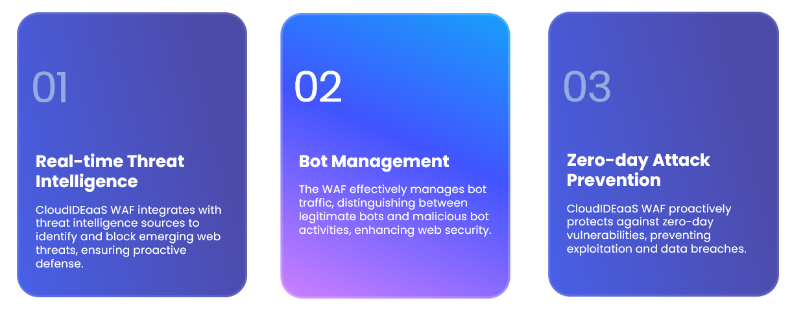
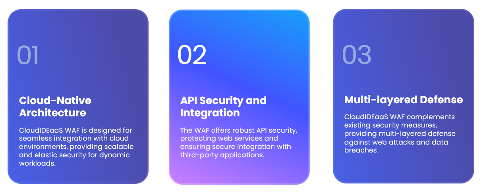
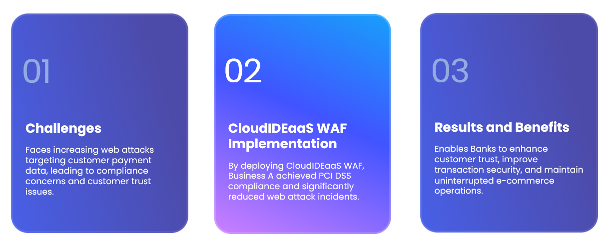
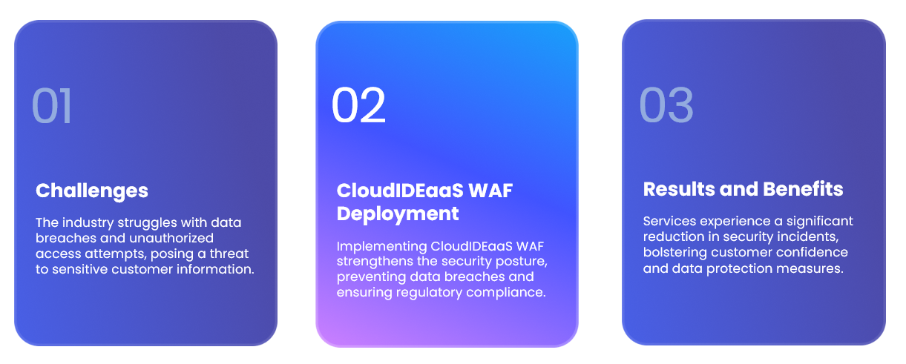

# Table of Contents
1. [Understanding Web Application Firewalls](#whatisawaf)
2. [WAF Features and Benefits](#featuresbenefits)
3. [Case Studies and Testimonials](#casestudies)

# What is a Web Application Firewall (WAF)?<a name="whatisawaf" />

## Advanced Threat Protection

* Real-time Threat Intelligence - CloudIDEaaS WAF integrates with threat intelligence sources to identify and block emerging web threats, ensuring proactive defense.
* Bot Management - The WAF effectively manages bot traffic, distinguishing between legitimate bots and malicious bot activities, enhancing web security.
* Zero-day Attack Prevention - CloudIDEaaS WAF proactively protects against zero-day vulnerabilities, preventing exploitation and data breaches.

## Scalability and Integration

* Cloud-Native Architecture- CloudIDEaaS WAF is designed for seamless integration with cloud environments, providing scalable and elastic security for dynamic workloads.
* API Security and Integration - The WAF offers robust API security, protecting web services and ensuring secure integration with third-party applications.
* Multi-layered Defense - CloudIDEaaS WAF complements existing security measures, providing multi-layered defense against web attacks and data breaches.

## Benefits/Features <a name="#featuresbenefits" />

### Geographic
* IP Fencing - If you know a malicious request is coming from a specific IP address, deny them with WAF blacklisting or allow with whitelisting-only scenarios.
* Geo-fencing and Geo-blocking - Used to create a virtual perimeter or boundary around a specific geographical area. When a user’s IP address falls within the predefined boundary, the WAF can allow or restrict access to certain content or features.  CloudIDEaaS WAF using the GEO IP MaxMindDb to identify and allow or deny requests.
* Advanced attacker identification - Stores and logs both anonymous and authenticated connections.  Stores IP addresses, activity, geographical information, and service provider hops.  Zero in on area-level within miles of attacker location.  Provides evidence for FISA or ISP warrants.
* Geo monitoring - know where your traffic is coming from.
* Google analytics integration - integrates for both HTML and API services.
* Reporting and analytics.
* Real-time activity vector map.
###  Anonymous and Third-Party Service Clients
* Rate limits - Apply denial of service rate limits or API usage limits.  Detects unusual activity such as bots or attack patterns.
* Bot mitigation - Can analyze cookies sent by the browser and check them to the databases of known bot cookies such as Udger, Checktor, and Whatisyourbrowser DB.
###  HTTP Protection
* Request/response inspection - analyze traffic using multiple filter layers, which can detect zero-day attacks, client-side attacks, bot attacks (such as DDoS attacks), virus files, and web application vulnerabilities.
* Header inspection - By examining the headers, detects specific patterns or anomalies that may indicate malicious activity, such as a malformed user agent or suspicious cookie values.
* Request/response body inspection - Examines the request and response body, query parameters, and other elements of the request to identify and block potential threats to the web application.
* Response inspection - Monitors and analyzes the traffic leaving a web application to identify and block any potentially malicious or unauthorized activity.
* Request/response capture - Capture full payload of requests and responses.  Ideal for lower environments for troubleshooting purposes.

### Configurable Rules
* Pre-defined rules - pre-defined rules and is designed to protect against common attacks, such as SQL injection, cross-site scripting (XSS), and other known vulnerabilities. These rules are updated regularly to address emerging threats.  CloudIDEaaS WAF uses rules maintained by OWASP, a non-profit, that has a community driven set of over 1,500 battle-tested rules by major organizations, corporate supporters, and sponsors.  Use all rules or a subset.  Expand when needed.
* Rule configurability - Rules can be configured, disabled, and set to soft mode to continue logging but prevent blocking.  All rules are config file driven.  Custom rules can also be defined.  Rules exist in cross-platform JSON files.
* Industry maintained data files - Contains widely common patterns and signatures to match against potential threats.

### Integrations
* Extensibility - Need something beyond existing functionality?  CloudIDEaaS WAF is fully extensible, allowing you to override, develop, or listen to HTTP properties and/or callbacks.
* Database driven - Use an out-of-the-box cloud database or use your own.  CloudIDEaaS WAF uses the repository pattern to allow for any back-end database.
* Artificial intelligence driven - Uses a neural network to learn from traffic and pick up on unusual attack vectors not handled directly by rules.
* Log driven - Full access to logs and offering of custom log solutions/providers that work with Serilog.
* Automatic certificate registration:
* Self-register lower environments (certificate authority not required)
* Submission to authorities for production or receive alerts for cert expiration.
* Kali Linux tested
* Sampling mode and kill switch - Disable WAF with one setting if ever needed.  Slowly turn up the dial by using sampling mode.  Specify the percent by which traffic blocking is applied and logging is preferred.

### Monitoring and Alerting
* Community attack alerting - Learn of attacks prior to happening at your facility. 
* Monitoring and alerting - Under attack, determine how to best be alerted:
** Email
** Slack
** Telegram
** Phone/SMS
** Custom
* Uptime and health monitoring - Monitors availability and performance of database connections, backend services, http, pingable services, etc.  Can be used in conjunction with WAF or as stand-alone.
### Product Offerings
 * Community edition - Download the SDK or community supported open-source code for level 1 support.  Upgrade at any time.
*  Reverse proxy - cloud version - Keep your current infrastructure intact and put a WAF proxy in front of your existing endpoints.
*  Reverse proxy on-premise - Install inside or outside your demilitarization zone at your organization or data center.
*  In-process to your existing web server.
*  Appliance - Order a pre-configure firm-ware version to eliminate server maintenance and also get full, dedicated workhorse.

# Case Studies and Testimonials<a name="casestudies" />

## Banking and Financial: Securing E-commerce Transactions and Digital Strategy Solutions

* Challenges - Faces increasing web attacks targeting customer payment data, leading to compliance concerns and customer trust issues.
* CloudIDEaaS WAF Implementation - By deploying CloudIDEaaS WAF, Business A achieved PCI DSS compliance and significantly reduced web attack incidents.
* Results and Benefits - Enables Banks to enhance customer trust, improve transaction security, and maintain uninterrupted e-commerce operations.

## Health Industry: Protecting Sensitive Customer Data

* Challenges - The industry struggles with data breaches and unauthorized access attempts, posing a threat to sensitive customer information.
* CloudIDEaaS WAF Deployment - Implementing CloudIDEaaS WAF strengthens the security posture, preventing data breaches and ensuring regulatory compliance.
* Results and Benefits - Services experience a significant reduction in security incidents, bolstering customer confidence and data protection measures.

### Visit http://www.cloudideaas.com/WAFProtection
### Contact: consulting@cloudideaas.com

